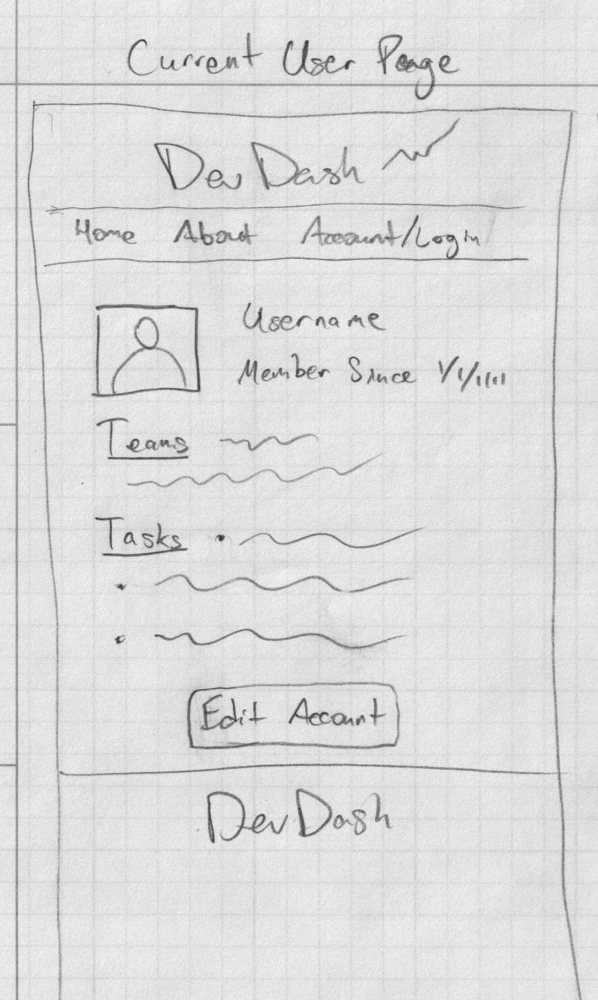
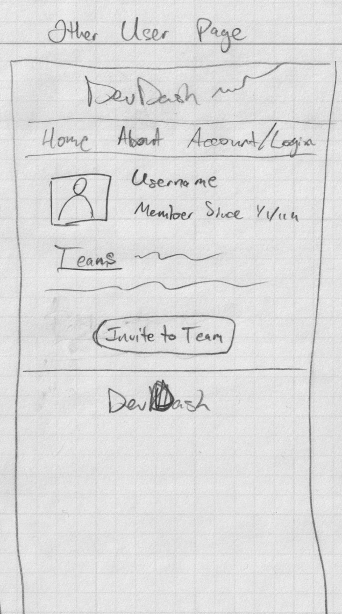
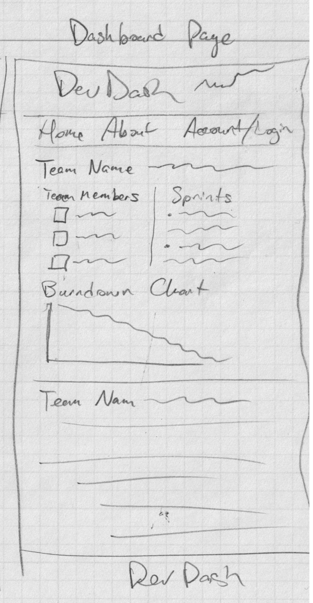

# PAGE_TESTING.md

This document defines the **pages** AgileFlow will implement and what is required to (1 render them correctly and (2) test them consistently.

At least **5 independent pages** are included below.

---

## Conventions Used in This Document

### Parameter Types
- **Route params**: values embedded in the URL path (e.g., `/groups/:groupId`)
- **Query params**: values after `?` in the URL (e.g., `?tab=tasks`)
- **State params**: values passed through navigation state (optional; avoid for critical data)

### Data Types
- **Auth state**: current user identity + session token
- **API data**: data fetched from backend services
- **UI state**: transient values like form fields, selected filters, toggles

### Mockups
Each page includes a **low-fidelity mockup** (ASCII wireframe). Teams may replace these with hand-drawn screenshots later.

---

# 1. Landing Page (by Erick Samayoa)

## Page Description
- Purpose: (One-sentence description of basic utility of this page.)
- (Provide a short feature summary so the purpose is clear before authentication.)

## Mockup
(This should be a wireframe drawing of the page. Just do it on paper and take a picture to place here.)

## Parameters Needed for the Page
- Route params: (List any route parameters necessary for navigating to this page. If not necessary, list "none".)
- Query params: (List necessary query parameters that should be included in URL. If not necessary, list "none".)

## Data Needed to Render the Page
### Static Content
- (List these contents.)
### API Fetches
- (List these or write "none")
### State Parameters
- (Auth of current user? Otherwise "none")

## Links Rendered on the Page
(This can include navigation links and other links/buttons)
- Example: **Log In** → `/login`
- Example: **Sign Up** → `/signup`

## Tests for Verifying Rendering of the Page
1. **Renders key UI elements**
   - Example: App title displays
   - Example: Log In and Sign Up buttons are visible and clickable
2. **Redirect behavior for authenticated users** (if necessary)
   - Example: If user is logged in, navigating to `/` redirects to `/dashboard`
3. **Redirect query param**
   - Example: Visiting `/?redirect=/groups/123` and clicking Log In should preserve redirect intent (either via query or state)

---

# 2. Login Page (by Sergio Rojas-Aguilar)

## Page Description
- Purpose: (One-sentence description of basic utility of this page.)
- (Provide a short feature summary so the purpose is clear before authentication.)

## Mockup
(This should be a wireframe drawing of the page. Just do it on paper and take a picture to place here.)

## Parameters Needed for the Page
- Route params: (List any route parameters necessary for navigating to this page. If not necessary, list "none".)
- Query params: (List necessary query parameters that should be included in URL. If not necessary, list "none".)

## Data Needed to Render the Page
### Static Content
- (List these contents.)
### API Fetches
- (List these or write "none")
### State Parameters
- (Auth of current user? Otherwise "none")

## Links Rendered on the Page
(This can include navigation links and other links/buttons)
- Example: **Log In** → `/login`
- Example: **Sign Up** → `/signup`

## Tests for Verifying Rendering of the Page
1. **Renders key UI elements**
   - Example: App title displays
   - Example: Log In and Sign Up buttons are visible and clickable
2. **Redirect behavior for authenticated users** (if necessary)
   - Example: If user is logged in, navigating to `/` redirects to `/dashboard`
3. **Redirect query param**
   - Example: Visiting `/?redirect=/groups/123` and clicking Log In should preserve redirect intent (either via query or state)

---

# 3. Create User Account Page (by Sergio Rojas-Aguilar)

## Page Description
- Purpose: (One-sentence description of basic utility of this page.)
- (Provide a short feature summary so the purpose is clear before authentication.)

## Mockup
(This should be a wireframe drawing of the page. Just do it on paper and take a picture to place here.)

## Parameters Needed for the Page
- Route params: (List any route parameters necessary for navigating to this page. If not necessary, list "none".)
- Query params: (List necessary query parameters that should be included in URL. If not necessary, list "none".)

## Data Needed to Render the Page
### Static Content
- (List these contents.)
### API Fetches
- (List these or write "none")
### State Parameters
- (Auth of current user? Otherwise "none")

## Links Rendered on the Page
(This can include navigation links and other links/buttons)
- Example: **Log In** → `/login`
- Example: **Sign Up** → `/signup`

## Tests for Verifying Rendering of the Page
1. **Renders key UI elements**
   - Example: App title displays
   - Example: Log In and Sign Up buttons are visible and clickable
2. **Redirect behavior for authenticated users** (if necessary)
   - Example: If user is logged in, navigating to `/` redirects to `/dashboard`
3. **Redirect query param**
   - Example: Visiting `/?redirect=/groups/123` and clicking Log In should preserve redirect intent (either via query or state)

---

# 4. Edit User Account Page (by Sergio Rojas-Aguilar)

## Page Description
- Purpose: (One-sentence description of basic utility of this page.)
- (Provide a short feature summary so the purpose is clear before authentication.)

## Mockup
(This should be a wireframe drawing of the page. Just do it on paper and take a picture to place here.)

## Parameters Needed for the Page
- Route params: (List any route parameters necessary for navigating to this page. If not necessary, list "none".)
- Query params: (List necessary query parameters that should be included in URL. If not necessary, list "none".)

## Data Needed to Render the Page
### Static Content
- (List these contents.)
### API Fetches
- (List these or write "none")
### State Parameters
- (Auth of current user? Otherwise "none")

## Links Rendered on the Page
(This can include navigation links and other links/buttons)
- Example: **Log In** → `/login`
- Example: **Sign Up** → `/signup`

## Tests for Verifying Rendering of the Page
1. **Renders key UI elements**
   - Example: App title displays
   - Example: Log In and Sign Up buttons are visible and clickable
2. **Redirect behavior for authenticated users** (if necessary)
   - Example: If user is logged in, navigating to `/` redirects to `/dashboard`
3. **Redirect query param**
   - Example: Visiting `/?redirect=/groups/123` and clicking Log In should preserve redirect intent (either via query or state)

---

# 5. Current User Page (by Mike Davis)

## Page Description
- Purpose: Lay out information about the session's current user
- This page provides user information about the current user including things like username, profile picture, teams/tasks they're assigned to, and other things. There will also be top-of-page navigation links to other pages, and buttons in the main body of the page that navigate to edit account

## Mockup

## Parameters Needed for the Page
- Route params: /users/:id
- Query params: none

## Data Needed to Render the Page
### Static Content
- (List these contents.)
### API Fetches
- (List these or write "none")
### State Parameters
- (Auth of current user? Otherwise "none")

## Links Rendered on the Page
(This can include navigation links and other links/buttons)
- Example: **Log In** → `/login`
- Example: **Sign Up** → `/signup`

## Tests for Verifying Rendering of the Page
1. **Renders key UI elements**
   - Example: App title displays
   - Example: Log In and Sign Up buttons are visible and clickable
2. **Redirect behavior for authenticated users** (if necessary)
   - Example: If user is logged in, navigating to `/` redirects to `/dashboard`
3. **Redirect query param**
   - Example: Visiting `/?redirect=/groups/123` and clicking Log In should preserve redirect intent (either via query or state)

---

# 6. Other User Page (by Mike Davis)

## Page Description
- Purpose: Lay out information about another user
- This page provides user information about another user including things like username, profile picture, teams they're assigned to, and other things. There will also be top-of-page navigation links to other pages, and buttons in the main body of the page that allow you to invite them to your team

## Mockup

## Parameters Needed for the Page
- Route params: /users/:id
- Query params: none

## Data Needed to Render the Page
### Static Content
- (List these contents.)
### API Fetches
- (List these or write "none")
### State Parameters
- (Auth of current user? Otherwise "none")

## Links Rendered on the Page
(This can include navigation links and other links/buttons)
- Example: **Log In** → `/login`
- Example: **Sign Up** → `/signup`

## Tests for Verifying Rendering of the Page
1. **Renders key UI elements**
   - Example: App title displays
   - Example: Log In and Sign Up buttons are visible and clickable
2. **Redirect behavior for authenticated users** (if necessary)
   - Example: If user is logged in, navigating to `/` redirects to `/dashboard`
3. **Redirect query param**
   - Example: Visiting `/?redirect=/groups/123` and clicking Log In should preserve redirect intent (either via query or state)

---

# 7. Dashboard Page (by Mike Davis)

## Page Description
- Purpose: (One-sentence description of basic utility of this page.)
- (Provide a short feature summary so the purpose is clear before authentication.)

## Mockup

## Parameters Needed for the Page
- Route params: (List any route parameters necessary for navigating to this page. If not necessary, list "none".)
- Query params: (List necessary query parameters that should be included in URL. If not necessary, list "none".)

## Data Needed to Render the Page
### Static Content
- (List these contents.)
### API Fetches
- (List these or write "none")
### State Parameters
- (Auth of current user? Otherwise "none")

## Links Rendered on the Page
(This can include navigation links and other links/buttons)
- Example: **Log In** → `/login`
- Example: **Sign Up** → `/signup`

## Tests for Verifying Rendering of the Page
1. **Renders key UI elements**
   - Example: App title displays
   - Example: Log In and Sign Up buttons are visible and clickable
2. **Redirect behavior for authenticated users** (if necessary)
   - Example: If user is logged in, navigating to `/` redirects to `/dashboard`
3. **Redirect query param**
   - Example: Visiting `/?redirect=/groups/123` and clicking Log In should preserve redirect intent (either via query or state)

---

# 8. Project Page (by Carolina Perez)

## Page Description
- Purpose: (One-sentence description of basic utility of this page.)
- (Provide a short feature summary so the purpose is clear before authentication.)

## Mockup
(This should be a wireframe drawing of the page. Just do it on paper and take a picture to place here.)

## Parameters Needed for the Page
- Route params: (List any route parameters necessary for navigating to this page. If not necessary, list "none".)
- Query params: (List necessary query parameters that should be included in URL. If not necessary, list "none".)

## Data Needed to Render the Page
### Static Content
- (List these contents.)
### API Fetches
- (List these or write "none")
### State Parameters
- (Auth of current user? Otherwise "none")

## Links Rendered on the Page
(This can include navigation links and other links/buttons)
- Example: **Log In** → `/login`
- Example: **Sign Up** → `/signup`

## Tests for Verifying Rendering of the Page
1. **Renders key UI elements**
   - Example: App title displays
   - Example: Log In and Sign Up buttons are visible and clickable
2. **Redirect behavior for authenticated users** (if necessary)
   - Example: If user is logged in, navigating to `/` redirects to `/dashboard`
3. **Redirect query param**
   - Example: Visiting `/?redirect=/groups/123` and clicking Log In should preserve redirect intent (either via query or state)

---

# 9. Sprint Page (by Carolina Perez)

## Page Description
- Purpose: (One-sentence description of basic utility of this page.)
- (Provide a short feature summary so the purpose is clear before authentication.)

## Mockup
(This should be a wireframe drawing of the page. Just do it on paper and take a picture to place here.)

## Parameters Needed for the Page
- Route params: (List any route parameters necessary for navigating to this page. If not necessary, list "none".)
- Query params: (List necessary query parameters that should be included in URL. If not necessary, list "none".)

## Data Needed to Render the Page
### Static Content
- (List these contents.)
### API Fetches
- (List these or write "none")
### State Parameters
- (Auth of current user? Otherwise "none")

## Links Rendered on the Page
(This can include navigation links and other links/buttons)
- Example: **Log In** → `/login`
- Example: **Sign Up** → `/signup`

## Tests for Verifying Rendering of the Page
1. **Renders key UI elements**
   - Example: App title displays
   - Example: Log In and Sign Up buttons are visible and clickable
2. **Redirect behavior for authenticated users** (if necessary)
   - Example: If user is logged in, navigating to `/` redirects to `/dashboard`
3. **Redirect query param**
   - Example: Visiting `/?redirect=/groups/123` and clicking Log In should preserve redirect intent (either via query or state)

---

# 10. Task Page (by Andrew MacRossie)

## Page Description
- Purpose: (One-sentence description of basic utility of this page.)
- (Provide a short feature summary so the purpose is clear before authentication.)

## Mockup
(This should be a wireframe drawing of the page. Just do it on paper and take a picture to place here.)

## Parameters Needed for the Page
- Route params: (List any route parameters necessary for navigating to this page. If not necessary, list "none".)
- Query params: (List necessary query parameters that should be included in URL. If not necessary, list "none".)

## Data Needed to Render the Page
### Static Content
- (List these contents.)
### API Fetches
- (List these or write "none")
### State Parameters
- (Auth of current user? Otherwise "none")

## Links Rendered on the Page
(This can include navigation links and other links/buttons)
- Example: **Log In** → `/login`
- Example: **Sign Up** → `/signup`

## Tests for Verifying Rendering of the Page
1. **Renders key UI elements**
   - Example: App title displays
   - Example: Log In and Sign Up buttons are visible and clickable
2. **Redirect behavior for authenticated users** (if necessary)
   - Example: If user is logged in, navigating to `/` redirects to `/dashboard`
3. **Redirect query param**
   - Example: Visiting `/?redirect=/groups/123` and clicking Log In should preserve redirect intent (either via query or state)