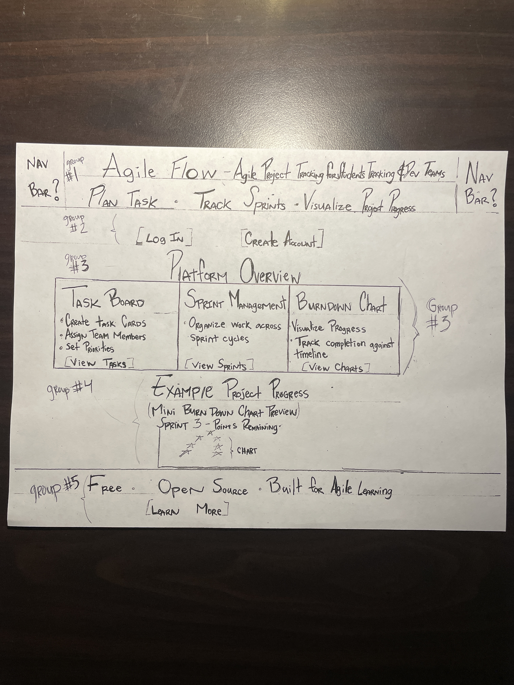
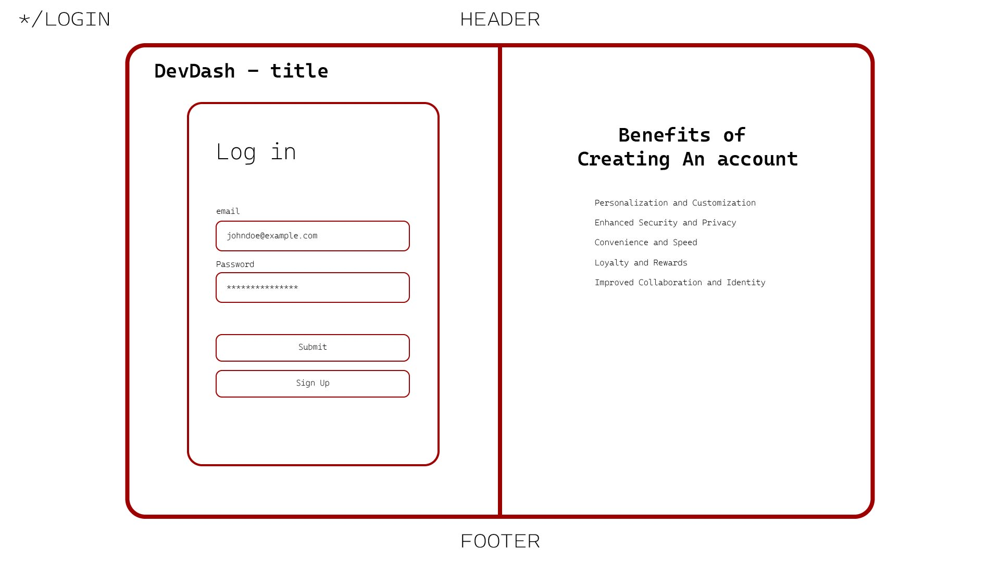
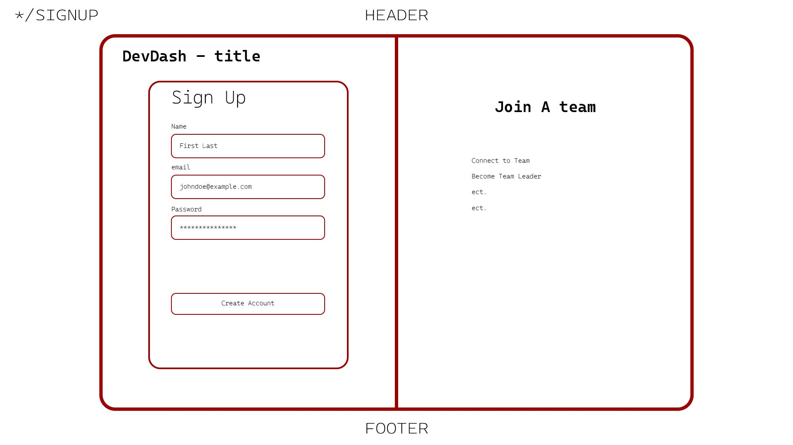
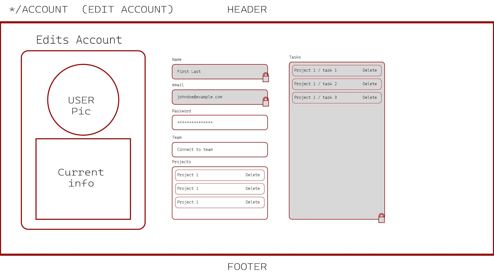

# PAGE_TESTING.md

This document defines the **pages** AgileFlow will implement and what is required to (1 render them correctly and (2) test them consistently.

At least **5 independent pages** are included below.

---

## Conventions Used in This Document

### Parameter Types
- **Route params**: values embedded in the URL path (e.g., `/groups/:groupId`)
- **Query params**: values after `?` in the URL (e.g., `?tab=tasks`)
- **State params**: values passed through navigation state (optional; avoid for critical data)

### Data Types
- **Auth state**: current user identity + session token
- **API data**: data fetched from backend services
- **UI state**: transient values like form fields, selected filters, toggles

### Mockups
Each page includes a **low-fidelity mockup** (ASCII wireframe). Teams may replace these with hand-drawn screenshots later.

---

# 1. Landing Page (by Erick Samayoa)

## Page Description
- **Purpose:** Introduce AgileFlow (by DevDash) and provide a clear overview of the platform before authentication. This page explains the core value of the application and directs new users to log in or create an account.

- **Feature Summary:** AgileFlow is a web-based agile project tracking platform that helps teams organize development work using tasks, sprints, and progress visualizations. Users can manage task boards, monitor sprint progress, and track project velocity through burndown charts in a simple, accessible interface designed for students and development teams.

## Mockup

Example layout reference ASCII EXAMPLE:

------------------------------------------------------------------
| AgileFlow - Agile Project Tracking for Students & Dev Teams    |
| Plan tasks • Track sprints • Visualize project progress        |
|----------------------------------------------------------------|
|             [ Log In ]      [ Create Account ]                 |
|----------------------------------------------------------------|
|                     Platform Overview                          |
|----------------------------------------------------------------|
|  TASK BOARD       |  SPRINT MANAGEMENT  |  BURNDOWN CHART      |
|-------------------|---------------------|----------------------|
| Create task cards | Organize work       | Visualize progress   |
| Assign members    | across sprint       | Track completion     |
| Set priorities    | cycles              | against timeline     |
|                   |                     |                      |
| [View Tasks]      | [View Sprints]      | [View Charts]        |
|----------------------------------------------------------------|
|                 Example Project Progress                       |
|----------------------------------------------------------------|
|                 (Mini Burndown Chart Preview)                  |
|                 Sprint 4 - Story Points Remaining              |
|                       *                                        |
|                     *   *                                      |
|                   *       *                                    |
|----------------------------------------------------------------|
|        Free • Open Source • Built for Agile Learning           |
|                     [ Learn More ]                             |
------------------------------------------------------------------

---

## Parameters Needed for the Page
- **Route params:** none
- **Query params:** Optional redirect parameter.
   -Example: /
   /?redirect=/projects/123

This allows the system to send the user back to the page they originally attempted to access after authentication.

## Data Needed to Render the Page
### Static Content
- Application title: **AgileFlow**
- Tagline / product description
- Hero section with **Log In** and **Create Account** buttons
- Feature overview section including: Task Board, Sprint Management, Burndown Charts
- Example burndown chart preview (static visual)
- Footer messaging (e.g., “Free • Open Source • Built for Agile Learning”)
- Learn More button or link
  
### API Fetches
- None required for the landing page.  
This page primarily displays static content before authentication.  
*(Optional future improvement: marketing content or feature statistics fetched from an API.)*

### State Parameters
- Authentication state of the current user
- Determines whether the user should:
  - remain on the landing page, or  
  - automatically redirect to the dashboard

## Links Rendered on the Page
- Log In → `/login`
- Create Account → `/signup`
- Optional: Learn More → `/about`
- Optional: Dashboard → `/dashboard` (if already authenticated)
- Optional navigation bar: Home → `/`, GitHub Repository → external link

## Tests for Verifying Rendering of the Page
1. **Renders key UI elements**
   - Application title **AgileFlow** is visible
   - Tagline describing the platform displays correctly
   - Log In and Create Account buttons are visible
   - Feature overview section (Task Board, Sprint Management, Burndown Chart) renders
   - Example burndown chart preview appears
   - Learn More button appears in the footer

   - Button and link functionality:
      - Log In button navigates to `/login`
      - Create Account button navigates to `/signup`
      - Learn More button navigates to `/about` (if implemented)
        
2. **Redirect behavior for authenticated users** (if necessary)
   - If a user is already logged in and navigates to `/`, they are automatically redirected to `/dashboard`
     
3. **Redirect query param**
   - If a user attempts to visit a protected page such as `/projects/123` and is redirected to `/` with `?redirect=/projects/123`,  
  after logging in successfully, the system should redirect them back to `/projects/123`

### Optional Additions
- To match the React frontend structure, suggested build for landing page routes:
/ → LandingPage
/login → LoginPage
/signup → SignupPage
/dashboard → DashboardPage
/projects/:id → ProjectPage

---
# 2. Login Page (by Sergio Rojas-Aguilar)

## Page Description
- Purpose: Allows existing users to log in to the application using their credentials.

- Functionality: Authenticates the user and establishes a session before redirecting them to the main dashboard.

## Mockup

## Parameters Needed for the Page
- Route params: /login

- Query params: Optional redirect parameter (e.g. /login?redirect=/dashboard)

## Data Needed to Render the Page
### Static Content
- Application title / logo

- Login form

   - Email or Username input

   - Password input

- Log In button

- Sign Up link

### API Fetches

- **POST** /api/auth/login

   - Authenticates the user credentials
   - Returns session token or authentication status

### State Parameters

- Authentication state
- Login form input state
- Login error state (invalid credentials, server error)

## Links Rendered on the Page

- **Sign Up** → `*/signup`

## Tests for Verifying Rendering of the Page
1. **Renders key UI elements**

- Application title or logo is visible
- Email/Username and Password input fields render
- Log In button is visible and clickable
- Sign Up link is visible

2. **Form interaction**
- User can type into input fields
- Login button submits form

3. **Authentication behavior**
- Valid credentials redirect user to /dashboard
- Invalid credentials show an error message

4. **Redirect behavior for authenticated users**
- If a user is already logged in, navigating to /login redirects to /dashboard

---

# 3. Create User Account Page (by Sergio Rojas-Aguilar)

## Page Description
- Purpose: Allows new users to create an account for the application.
- Collects required registration information, validates input, and creates a new user account.

## Mockup

## Parameters Needed for the Page
- Route params: /signup
- Query params: None

## Data Needed to Render the Page
### Static Content
**Application title / logo**
- Registration form fields:
   - Username
   - Email
   - Password
   - Confirm Password
- Create Account button
### API Fetches
- POST: /api/users
   - Create NEW User
### State Parameters
- Form input state
- Form validation state
- Account creation status (success / failure)
- Error messages

## Tests for Verifying Rendering of the Page
1. **Renders key UI elements**
   - Application title is visible
   - All required input fields render
   - Create Account button is visible
2. **Redirect behavior for authenticated users** (if necessary)
   - Invalid inputs display validation errors
   - Password confirmation must match 
3. **Successful account creation**
   - Submitting valid form data creates a new user
   - User is redirected to /login or /dashboard
4. **Access behavior**
   - Page is typically accessed from the login page
   - Already authenticated users may be redirected to /dashboard
---

# 4. Edit User Account Page (by Sergio Rojas-Aguilar)

## Page Description
- Purpose: Allows authenticated users to update their account information.
- Functionality: Users can modify their profile details such as username, email, or password.

## Mockup

## Parameters Needed for the Page
- Route params: /account/edit
- Query params: None

## Data Needed to Render the Page
### Static Content
- (List these contents.)
### API Fetches
- (List these or write "none")
### State Parameters
- Application title
- Editable user account form
   - Username
   - Email
   - Password (optional change)
   - Confirm Password
- Save Changes button

## Links Rendered on the Page
**GET:** /api/users/me
   - Retrieves the current user's account information

**PUT:** /api/users/me
   - Updates the user account information

## Tests for Verifying Rendering of the Page
1. **Renders key UI elements**
   - User account fields populate with current data
   - Save Changes button is visible
2. **Redirect behavior for authenticated users** (if necessary)
   - User can modify editable fields
   - Validation occurs on submit
3. **Update behavior**
   - Valid changes update the user account
   - Success message appears after update
4. **Authentication requirement**
   - If the user is not authenticated, redirect to /login
---

# 5. Current User Page (by Mike Davis)

## Page Description
- Purpose: (One-sentence description of basic utility of this page.)
- (Provide a short feature summary so the purpose is clear before authentication.)

## Mockup
(This should be a wireframe drawing of the page. Just do it on paper and take a picture to place here.)

## Parameters Needed for the Page
- Route params: (List any route parameters necessary for naivgating to this page. If not necessary, list "none".)
- Query params: (List necessary query parameters that should be included in URL. If not necessary, list "none".)

## Data Needed to Render the Page
### Static Content
- (List these contents.)
### API Fetches
- (List these or write "none")
### State Parameters
- (Auth of current user? Otherwise "none")

## Links Rendered on the Page
(This can include navigation links and other links/buttons)
- Example: **Log In** → `/login`
- Example: **Sign Up** → `/signup`

## Tests for Verifying Rendering of the Page
1. **Renders key UI elements**
   - Example: App title displays
   - Example: Log In and Sign Up buttons are visible and clickable
2. **Redirect behavior for authenticated users** (if necessary)
   - Example: If user is logged in, navigating to `/` redirects to `/dashboard`
3. **Redirect query param**
   - Example: Visiting `/?redirect=/groups/123` and clicking Log In should preserve redirect intent (either via query or state)

---

# 6. Other User Page (by Mike Davis)

## Page Description
- Purpose: (One-sentence description of basic utility of this page.)
- (Provide a short feature summary so the purpose is clear before authentication.)

## Mockup
(This should be a wireframe drawing of the page. Just do it on paper and take a picture to place here.)

## Parameters Needed for the Page
- Route params: (List any route parameters necessary for naivgating to this page. If not necessary, list "none".)
- Query params: (List necessary query parameters that should be included in URL. If not necessary, list "none".)

## Data Needed to Render the Page
### Static Content
- (List these contents.)
### API Fetches
- (List these or write "none")
### State Parameters
- (Auth of current user? Otherwise "none")

## Links Rendered on the Page
(This can include navigation links and other links/buttons)
- Example: **Log In** → `/login`
- Example: **Sign Up** → `/signup`

## Tests for Verifying Rendering of the Page
1. **Renders key UI elements**
   - Example: App title displays
   - Example: Log In and Sign Up buttons are visible and clickable
2. **Redirect behavior for authenticated users** (if necessary)
   - Example: If user is logged in, navigating to `/` redirects to `/dashboard`
3. **Redirect query param**
   - Example: Visiting `/?redirect=/groups/123` and clicking Log In should preserve redirect intent (either via query or state)

---

# 7. Dashboard Page (by Mike Davis)

## Page Description
- Purpose: (One-sentence description of basic utility of this page.)
- (Provide a short feature summary so the purpose is clear before authentication.)

## Mockup
(This should be a wireframe drawing of the page. Just do it on paper and take a picture to place here.)

## Parameters Needed for the Page
- Route params: (List any route parameters necessary for naivgating to this page. If not necessary, list "none".)
- Query params: (List necessary query parameters that should be included in URL. If not necessary, list "none".)

## Data Needed to Render the Page
### Static Content
- (List these contents.)
### API Fetches
- (List these or write "none")
### State Parameters
- (Auth of current user? Otherwise "none")

## Links Rendered on the Page
(This can include navigation links and other links/buttons)
- Example: **Log In** → `/login`
- Example: **Sign Up** → `/signup`

## Tests for Verifying Rendering of the Page
1. **Renders key UI elements**
   - Example: App title displays
   - Example: Log In and Sign Up buttons are visible and clickable
2. **Redirect behavior for authenticated users** (if necessary)
   - Example: If user is logged in, navigating to `/` redirects to `/dashboard`
3. **Redirect query param**
   - Example: Visiting `/?redirect=/groups/123` and clicking Log In should preserve redirect intent (either via query or state)

---

# 8. Project Page (by Carolina Perez)

## Page Description
### Purpose: Overview of a specific project and the sprints,tasks,users and information that are associated with it. 
- Displaying the burndown chart of a project, as well as divding the sprints into three tiers: Current, Upcoming, Past/Archived based on end date of the sprint.
- User is able to see other team members and be able to go to their own user page, projects list page, burndown chart editing page and sprints page from this page.
- User or Viewer should get good sense of the progress of the project and track progress.
- if NO DATA present, then the user will get an error page and a button to redirect ot the projects page

## Mockup

## Parameters Needed for the Page
- Route params: project_id -> projects/project_id 
- Query params: none

## Data Needed to Render the Page
### Static Content
- the page content it self -> the text
- the boxes with the content
- user icon
- page title
- table layout without the data
- buttons(back arrow)
- dropdown arrow
     - default dropdowns (Current is default to open and the others are defaulted to close)
- style scheme the group decides  on that will be uniform throughout
### API Fetches
- GET /api/projects/project_id (project details) 
- project name
- project sprints
- project members
- burndown chart and its story points
- sprint info(end date, created at, points, status, priority)
- current, upcoming and past info(end date based)
### State Parameters
- Auth state of the current user 

## Links Rendered on the Page
(This can include navigation links and other links/buttons)
-  **Projects Page** → `/projects`
-  **Sprints Page** → `/sprints`
-  **User Page** → `/user/:user_id`
-  **Burndown Chart Page** → `projects/:project_id/burndown_chart`

## Tests for Verifying Rendering of the Page
1. **Renders key UI elements**
   - Example: App title displays
   - Example: Project Name, icons, and boxes are displayed
   - interactive elements work onClick()
   - Members Tab appears onClick or onMouseEnter() - whichever we decide
   - Empty state tests(no sprints allocated to a project)
2. **Redirect behavior for authenticated users** (if necessary)
   - If user is logged in, navigating to `/user` redirects to `/user/user_id` through user button
   - If user clicks back arrow redirects to `/projects`
   - if user clicks sprint text they will get redirected to `/sprint_id`
3. **Redirect query param**
   - N/A

---

# 9. Sprint Page (by Carolina Perez)

## Page Description
- Purpose: his page displays tasks associated with a specific sprint and allows the user to view task details, sort tasks, and edit sprint information such as description, dates, and new tasks
- The user will be shown details of a specific sprint, along with being able to add and sort tasks, view task details and add sprint details such as description, dates and new tasks
- If NO DATA then user will be shown an "error - sprint not found" 

## Mockup

## Parameters Needed for the Page
- Route params: sprint_id, project_id
- Query params: for the sort by function -> `//projects/:project_id/sprints/:sprint_id?sort=due_date` whatever we are sorting the tasks by.

## Data Needed to Render the Page
### Static Content
- table headers(col name) 
- edit pencil icon
- sort dropdown
- add task icon
- buttons (user and sort by button)
- text and outline boxes
- style schema
### API Fetches
- GET /api/projects/:project_id/sprints/:sprint_id
- GET task information such as due date, created at etc
- sprint info such as sprint number
- project name related to sprint
### State Parameters
- Auth of current user
- selected sort parameter

## Links Rendered on the Page
(This can include navigation links and other links/buttons)
- **User Page** → `/user/:user_id`
- **Project Page** → `/project/:project_id`
- **Task Page** → `/:task_id`
- **Add Task Button** → opens task creation modal

## Tests for Verifying Rendering of the Page
1. **Renders key UI elements**
   - Buttons are visible and clickable
   - icons are visible and clickable
   - checkboxes are interactive
   - format is displayed
2. **Redirect behavior for authenticated users** (if necessary)
   - If user is logged in, navigating to `/user` redirects to their user page
   - If user clicks projects name they will be redirected to `/projects/project_id` to see the other tasks
   - If the user clicks onthe task text they will be taken to `/tasks/task_id`  for further information on that task
3. **Redirect query param**
   - Visiting `/sprint_id?sort=due_date` will sort the task in order of Due Date and so on for Priority and Assignee

---

# 10. Task Page (by Andrew MacRossie)

## Page Description
- Purpose: This page displays the full details of a specific task within a sprint, allowing users to view and edit task metadata including priority, due date, project, sprint, and assignee, while also allowing users to read and post comments on the task.
- Feature Summary: The Task Page gives team members a focused, single-task view within the broader agile workflow. Once a user is logged in, they can interact with all task fields inline, update status, and add comments. The page reflects the tasks position within the burndown chart context, helping teams track progress against sprint goals. 

## Mockup

## Parameters Needed for the Page
- Route params: project_id/sprint_id/task_id 
- Query params: ?redirect

## Data Needed to Render the Page
### Static Content
- Priority, Due Date, Project, Sprint, Assignee
- Edit (an icon to edit needed fields)
- Comment section header and text input placeholder
- Status badge options (To Do, In Progress, Done)
- Submit/Save and Cancel buttons
- Empty state message if no comments exist yet
- Error messge: "Task not found" for invalid task_id
- "Back to Sprint" navigation label

### API Fetches
- GET /api/projects/:project_id — fetch project name and metadata
- GET /api/projects/:project_id/sprints/:sprint_id — fetch sprint number and dates
- GET /api/projects/:project_id/sprints/:sprint_id/tasks/:task_id — fetch full task detail:
- GET /api/tasks/:task_id/comments — fetch all comments in chronological order
- PATCH /api/tasks/:task_id — update editable fields (priority, due date, assignee, status)
- POST /api/tasks/:task_id/comments — submit a new comment

### State Parameters
- Auth of current user (user_id, display name, role, avatar)
- Edit mode toggle state per field (controls inline editor visibility)
- Comment input field state (controlled text input)
- Loading/error state for async fetches

## Links Rendered on the Page
(This can include navigation links and other links/buttons)
- Project Page → /projects/:project_id
- Sprint Page (breadcrumb back) → /projects/:project_id/sprints/:sprint_id
- Assignee User Page → /users/:user_id
- Edit Task Fields → inline edit — no route change, state-driven toggle
- Add Comment Button → POST /api/tasks/:task_id/comments (no navigation)
- Delete Task Button → DELETE /api/tasks/:task_id → redirects to Sprint Page on success
- Burndown Chart → /projects/:project_id/burndown

## Tests for Verifying Rendering of the Page
1. **Renders key UI elements**
   - Task title is visible at the top of the page
   - All five metadata fields render with their labels and values: Priority, Due Date, Project, Sprint, Assignee
   - Edit (pencil) icon is visible next to each editable field and is clickable
   - Status badge displays the correct current status with appropriate color
   - Comment section renders below task details
   - Comment input box and submit button are visible and interactive
   - "Back to Sprint" breadcrumb link is visible in the page header
   - Error state: if task_id is invalid, "Task not found" message displays instead of task content
  
2. **Redirect behavior for authenticated users** (if necessary)
   - If user is NOT logged in, navigating to /projects/:project_id/sprints/:sprint_id/tasks/:task_id redirects to /login
   - If user IS logged in, the full task detail page renders correctly
   - Clicking the project name breadcrumb redirects to /projects/:project_id
   - Clicking the sprint name redirects to /projects/:project_id/sprints/:sprint_id
   - Clicking the assignee's name or avatar navigates to /users/:user_id
   - After deleting a task, the user is redirected to /projects/:project_id/sprints/:sprint_id
  
3. **Redirect query param**
   - Visiting the task page with ?redirect=/projects/42/sprints/7 and clicking "Back to Sprint" preserves and follows the redirect path
   - Visiting /login?redirect=/projects/42/sprints/7/tasks/99 after authentication completes redirects the user to the original task page
   - Query param is stripped from the URL after the redirect resolves (no stale ?redirect in address bar)
