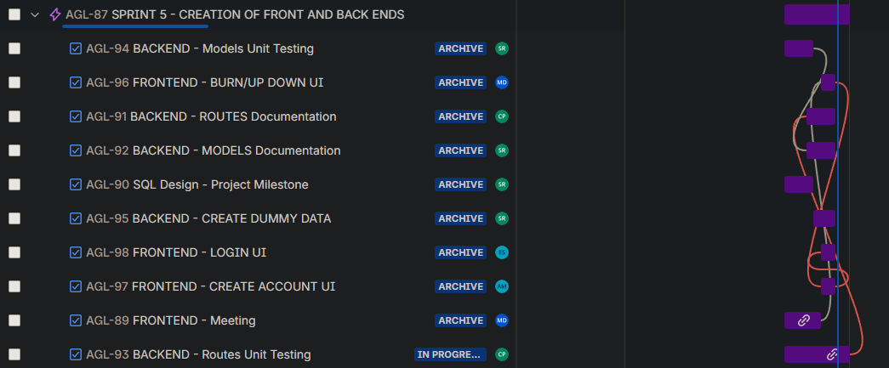

# WEEKLY_STATUS.md
## Project Milestone 3: Weekly Status Report

**Project:** Agile Flow  
**Team Number:** 9
**Team Name:** DevDash

---

## Reporting Period
**Week:**   
**Meeting Held:** Yes  
**Meeting Date:** March 29, 2026  
**Meeting Duration:** 1hr, with 30m breakouts for FE and BE teams
**Meeting Format:** Discord  

---

## Overview
    
    This document captures the **weekly status** of the Agile Flow project for the specified reporting period. It is intended to provide a **concise snapshot** of progress, plans, and risks, and will be updated weekly throughout the project.

    This weekly status format is designed to:
    - Monitor progress over time
    - Surface risks and bottlenecks early
    - Provide accountability for individual contributions
    - Supplement the project management tool used by the team

---

## Project Management Snapshot

The team is using a shared **Jira board** to manage tasks and sprint progress. At the time of this report:
   - Columns include: Completed, In Progress and Assigned/Created tasks 
   - Tasks are assigned to individual team members and typically created by the scrum master
   - Due dates and priorities are tracked per task
   - Team interaction is monitored and encouuraged through comments

Snippets of this week's Jira:

---

## Progress Since Last Week

    This week, the team broke out into front end and back end teams to focus on **building the foundation of the API, and creating the first pages on the front end with navigation**.

    Key accomplishments include:
    - Development and deployment of first run at API.
    - Creation of front end README, page structure, and navigation.
    - Creation of login and account creation pages.

**Sergio Rojas-Aguilar:**

- This week, the I focused on **insert**. 

**Michael Davis:** 

- This week, I focused on making sure all front end team members were familiar with our tech stack and how to develop within it.
- In particular, I hosted a walkthrough with one team member, during which we created two pages for the front end.

**Carolina Perez:** 

- This week, I focused on helping finalizing the backend models, completing model testing, and implementing CRUD routes with corresponding tests and documentation.

**Erick Samayoa:** 

- 

**Andrew MacRossie:** 

- Met with Mike and received guidance and instruction on branch structure, running npm, working with tailwind, and working with React

---

## Completed Tasks

**Sergio Rojas-Aguilar:**

- Task 1 : Description 

**Michael Davis:** 

- Creation of login and account creation pages, priming them for fetches to the API.

**Carolina Perez:** 

- Met with Sergio to disscuss remaining tasks
- Creating documentation for the files i made to help to the frontend unsderstand their setup
- CRUD routes
- routes testing

**Erick Samayoa:** 

- 

**Andrew MacRossie:** 

- Completed the Signup page and a prototype for the Dashboard page using chart.js. 

---

## Planned Tasks for Next Week

**Sergio Rojas-Aguilar:**

- Task 1 : Description 

**Michael Davis:** 

- I am tasked with deploying the front end to Render, so that we can have a functioning full stack application.
- I am also leading two different meetings the day before the next scrum, in which we will refine the front end so it functions properly.

**Carolina Perez:** 

- Finish route testing
- Meeting with Backend team again to disscuss remaining tasks
- Validation build, testing and documentation

**Erick Samayoa:** 

- 

**Andrew MacRossie:** 

- Connect to API for chart and signup/signin functionality, deploy to Render

---

## Blockers and Issues

    NOTES FROM TEMPLATE(DELETE LATER)

    notes from meeting Delete before submission:
    No major technical blockers were encountered this week.

    One discussion point involved balancing MVP scope versus optional enhancements. The team agreed to:
    - Focus on a **simple availability overlap view**
    - Defer advanced calendar interactions until later milestones (if time allows)

**Sergio Rojas-Aguilar:**

- Blockers and Issues : Description 

**Michael Davis:** 

- The main blocker will be that I have an exam in my other class on Friday. This will require most of my focus for two or three days of the week.

**Carolina Perez:** 

- I also have an exam, but other then that no additional blockers 

**Erick Samayoa:** 

- 

**Andrew MacRossie:** 

- Lack of development experience and time management are obstacles but are not insurmountable

---

## Risks and Mitigation

    NOTES FROM TEMPLATE(DELETE LATER)

    **Identified Risk:** Feature creep  
    - *Mitigation:* Strict adherence to MVP scope and milestone requirements

    **Identified Risk:** Frontend/backend integration complexity  
    - *Mitigation:* Develop and test API endpoints incrementally, starting early

**Sergio Rojas-Aguilar:**

- *Identified Risk:* Sample Risk
- *Mitigation:* Smaple Mitigation

**Michael Davis:** 

- *Identified Risk:* Not finishing all the tasks due to focus on other class.
- *Mitigation:* Proper delegation of tasks, with backloaded schedule of group meetings.

**Carolina Perez:** 

- *Identified Risk:* Route testing issues due to backend changes  
- *Mitigation:* Incremental testing of each CRUD route with validation and documentation

**Erick Samayoa:** 

- 

**Andrew MacRossie:** 

- Any risks I may be facing can be mitigated with communication with other team members and reaching out for help and clarification

---

## Team Reflection

- The team did well with breaking out into front end and back end teams, and everyone brought satisfactory progress reporting to the scrum meeting.
- The team in a good position to reach our MVP by the end of the project.
- The team is also bringing the final report into view as we finalize our app.

---

## Individual Contributions This Week

**Sergio Rojas-Aguilar:**

- Individual Contributions

**Michael Davis:** 

- Built login page, which served as a template for Andrew to build the account creation page under my guidance.

**Carolina Perez:** 

- Creation of routes
- Testing
- Documentation

**Erick Samayoa:** 

- 

**Andrew MacRossie:** 

- Created the initial prototype for the dashboard page and created a functional signup page

---

## Notes and Etiquette

**This document is to be finished by 11:59 PM MT on Sunday, the night of the relevant Scrum Meeting.**

**Each team member will be responsible to update their individual contributions.**
This file will be updated weekly as the project progresses.  
Earlier weekly entries may be retained below or moved to an archive directory if the file grows large.
